# Day 18 Final Report: Multithreaded C Video Compressor

## Executive summary

This project implements a complete lossy YUV420 video codec in C11 and uses
pthreads at two levels: independent frames may be active together, while block
rows inside each plane advance in a causal wavefront. The codec predicts each
8x8 block from reconstructed top and left neighbors, transforms and quantizes
the residual, applies zig-zag run-length encoding and Huffman coding, and then
immediately reconstructs the block so later predictions use exactly the pixels
the decoder will possess.

The final pipeline successfully encodes and decodes all Y, U, and V planes,
retains ordered compressed output on disk, and produces identical bitstreams
with one and four workers. On the three-frame 1280x720 test clip, the encoded
file is 105,453 bytes versus 4,147,200 raw bytes, or 39.33:1 compression. The
decoded result measures 38.53 dB overall PSNR. Helgrind reports no races or
lock-order errors in the tested configurations.

The performance results show useful but bounded parallel scaling. Eight
workers achieved 3.60x speedup in the original thread-count experiment. A
separate synchronization study found that publishing every completed block
was faster at four and eight workers than batching progress in groups of two
or four. A prediction ablation also showed that causal prediction reduced the
compressed file by 29.74% compared with replacing prediction by a constant
128-valued block.

## Architecture

```mermaid
flowchart LR
    A[Raw planar YUV420] --> B[Frame storage<br/>immutable orig + zeroed recon]
    B --> C[Row-job producer<br/>Y, U and V for every frame]
    C --> D[Bounded circular queue<br/>not-empty / not-full]
    D --> E[pthread worker pool]

    subgraph W[Per-frame wavefront]
        E --> F[Wait for top-row progress]
        F --> G[Predict from recon<br/>top + left]
        G --> H[Residual → DCT → quantize]
        H --> I[Zig-zag RLE]
        I --> J[Immediate reconstruction]
        J --> K[Publish row progress]
        K --> F
        J -. reconstructed boundaries .-> G
    end

    I --> L[Per-frame RLE block store]
    L --> M[Frame completion<br/>Huffman encode]
    M --> N[Reorder-buffer slot]
    N --> O[Writer thread<br/>next expected frame]
    O --> P[Ordered compressed bitstream]

    P --> Q[Huffman decode]
    Q --> R[RLE decode → dequantize → inverse DCT]
    R --> S[Decoder prediction from<br/>decoder recon]
    S --> T[Decoded YUV420]
    S -. reconstructed boundaries .-> S
```



The architecture separates five responsibilities:

1. **Frame ownership.** Each frame owns an immutable source buffer and a
   separate reconstruction buffer. `frame_plane()` alone knows how the packed
   YUV420 planes are laid out, preventing duplicated offset arithmetic.
2. **Work scheduling.** The producer creates one job for each block row of each
   plane and frame. A fixed-capacity circular queue supplies workers and applies
   backpressure when producers get ahead.
3. **Dependency control.** Each plane has its own `WavefrontSync`. A row may
   process column `c` only after the row above has published that column. The
   first row proceeds immediately; left-to-right execution supplies the left
   neighbor.
4. **Frame finalization and ordering.** Row workers store deterministic RLE
   output in frame-owned block positions. The last completed row builds the
   frame Huffman stream. Finished frames enter numbered reorder slots, and one
   writer emits only `next_expected_frame`, so unpredictable completion order
   never changes file order.
5. **Independent decoding.** The decoder rebuilds its own reconstruction state
   block by block. It does not receive predictions from the encoder; it derives
   them from the same causal rule, which keeps the bitstream self-contained.

## Codec data path

For each 8x8 block, the encoder averages the available reconstructed boundary
samples above and to the left. The first block uses 128, and edge blocks use
their one available neighbor. Subtracting this prediction removes much of the
slowly varying image content before transformation. A separable row/column DCT
then concentrates residual energy into low-frequency coefficients with
one-quarter of the core multiply-accumulate work of the direct 2D formula for
an 8x8 block.

Quantization rounds transformed coefficients according to a frequency-weighted
table. The resulting array is scanned in zig-zag order so the commonly zero
high-frequency tail becomes a small number of long RLE runs. A frame-wide
Huffman code compresses the resulting `(zero count, value)` symbols.

Reconstruction is part of encoding, not a later cleanup pass. The quantized
residual is dequantized, inverse transformed, added to the prediction, clipped,
and written into `recon` before progress is published. This ordering makes a
progress update a reliable promise that every pixel needed by a dependent row
is visible.

## Threading model

The queue is bounded at roughly four jobs per worker. Unlike a linked queue, it
does not allocate and free thousands of row nodes in the hot path, avoiding
allocator contention and improving locality. Consumers wait on `not_empty`;
the producer waits on `not_full`.

Within a plane, top-neighbor dependencies create a diagonal wavefront. At the
beginning only the first row can make progress. More rows become runnable as
the diagonal widens, after which the available parallelism narrows again near
the frame end. Condition broadcasts are deliberately used when progress is
published: all waiters recheck their own dependency, ensuring the eligible row
wakes even though unrelated rows may wake unnecessarily. This correctness
choice can cause a thundering herd.

Across frames, row jobs can overlap without sharing pixel storage. Once every
plane row of a frame completes, its frame-local output is finalized. The
reorder writer allows later frames to wait in slots while it writes earlier
frames in numerical order.

## Validation

Testing was layered to isolate failures:

- DCT/inverse-DCT, prediction, reconstruction, entropy coding, and frame-plane
  offsets have focused unit tests.
- Single-threaded `encode_row()` was first compared byte-for-byte with a plain
  nested traversal, proving wavefront bookkeeping did not change codec output.
- The real job queue was then tested with one worker before enabling two and
  four, separating queue/lifetime bugs from true dependency races.
- Multiworker reconstruction matched the serial baseline across repeated runs.
- The production test used three colorful 1280x720 frames rather than only the
  small fixture. One- and four-worker outputs matched across ten runs, and the
  retained files decoded identically.
- Apple Clang 17 and GCC 11 builds were warning-free with C11 pedantic warnings
  promoted to errors.
- Helgrind 3.18.1 under x86-64 Ubuntu reported `0 errors from 0 contexts` for
  the integration test and real encoder, including synchronization
  granularities 2 and 4.

The production-scale round trip measured 39.27 dB on Y, 38.50 dB on U, 36.42
dB on V, and 38.53 dB overall. Visual inspection found no chroma offset or U/V
swap.

## Performance results

### Thread-count scaling


The original Day 15 experiment averaged five timed runs after warm-up. Average
wall time fell from 0.540 seconds with one worker to 0.150 seconds with eight.
The corresponding speedups were 2.05x, 2.87x, and 3.60x for two, four, and
eight workers. Scaling is not linear because the wavefront has limited work
during ramp-up and ramp-down, and because setup, frame finalization, ordered
writing, I/O, queue operations, and synchronization are not perfectly
parallel.

### Compression benefit of prediction


This controlled Day 18 ablation used the same input, four workers, granularity
1, quantization table, transform, and entropy format. With prediction enabled,
the output was 105,453 bytes, a 39.33:1 ratio. Replacing neighbor prediction
with a flat value of 128 produced 150,083 bytes, or 27.63:1. Causal prediction
therefore removed 44,630 additional bytes—a 29.74% reduction relative to the
no-prediction output—because neighboring reconstructed blocks provide a much
closer baseline than a fixed mid-gray block.

### Synchronization granularity


The granularity experiment is a separate warmed benchmark campaign, so its
absolute values should not be mixed with the original Day 15 timings. At four
workers, publishing every block averaged 0.162 seconds, versus 0.190 for groups
of two and 0.182 for groups of four. At eight workers the averages were 0.132,
0.136, and 0.138 seconds respectively.

Coarser publication reduces mutex acquisitions and condition broadcasts, but
it also keeps completed blocks hidden from the next row until a whole group is
done. For this workload, DCT and entropy work make synchronization cheap enough
that preserving the widest possible wavefront matters more. Granularity 1
therefore remains the default.

## Design timeline

| Date | Milestone | Decision and reasoning |
| --- | --- | --- |
| Oct. 2 | Frame representation | Split source and reconstructed pixels so lossy state never overwrites ground truth. Centralize all YUV420 plane addressing in `frame_plane()`. Put a direct frame pointer in each job to avoid a shared lookup and make ownership explicit. |
| Oct. 2 | Reconstruction initialization | Start `recon` at zero. Preloading it with source pixels could conceal dependency bugs and let the encoder predict from information unavailable to the decoder. |
| Oct. 3 | Transform | Use a separable row-then-column DCT/IDCT. It is mathematically equivalent to direct 2D evaluation but reduces an N×N transform from O(N⁴) to O(N³). |
| Oct. 3 | Causal prediction | Read only previously reconstructed top and left pixels. This gives encoder and decoder the same information and preserves an acyclic processing order. |
| Oct. 3 | Immediate reconstruction | Rebuild each block before encoding its successor or releasing dependent rows. Otherwise later predictions would see missing or stale neighbors. |
| Oct. 3 | Entropy preparation | Zig-zag coefficients from low to high spatial frequency before RLE, placing the quantized zero-heavy region into longer runs. |
| Oct. 3 | Decoder state | Recompute predictions from decoder-owned reconstruction instead of storing encoder predictions, keeping the format deterministic and avoiding hidden state. |
| Oct. 3 | Wavefront wakeups | Broadcast progress because several rows share one condition and only each waiter knows whether its own column is ready. Accept the thundering-herd cost for correctness. |
| Oct. 3 | Publication ordering | Treat progress as a release point: prediction, transform, entropy preparation, and reconstruction must all finish before the block becomes visible to another row. |
| Oct. 3 | Job queue | Use a bounded circular buffer for fixed memory, cache locality, and backpressure; avoid row-level linked-list allocations and allocator lock contention. |
| Oct. 3 | Debugging strategy | Prove the pool with one worker first. That exercises queueing and object lifetimes while excluding simultaneous wavefront execution, making failures easier to classify. |
| Oct. 7 | Concurrency validation | Repeated two- and four-worker comparisons matched the serial baseline. Helgrind found no races, supporting continuation with wavefront scheduling. |
| Oct. 7 | Production pipeline | Add full Y/U/V processing and numbered reorder slots. Production-scale, retained-output, and chroma gates all passed; output order remained independent of worker completion order. |
| Oct. 8 | Scaling study | Benchmark one through eight workers. Results showed strong initial gains followed by diminishing returns from causal stalls, serial work, and synchronization overhead. |
| Oct. 8 | Granularity study | Test batched progress publication. Fewer wakeups did not compensate for reduced wavefront width, so per-block publication remained the default. |
| Day 18 | Reporting and prediction ablation | Generate reproducible figures directly from CSV measurements, consolidate the architecture and decision history, and quantify prediction's 29.74% compressed-size benefit. |

## Limitations and next steps

The benchmark clip contains only three frames, and `/usr/bin/time -p` reports
to 0.01 seconds, so small differences should be treated as noise rather than
universal rankings. A larger corpus covering motion, texture, resolution, and
clip duration would provide tighter confidence intervals and reveal how
content changes prediction efficiency. The current program also loads every
input frame before scheduling work; a bounded frame window would reduce memory
use for long videos while preserving cross-frame concurrency.

Additional performance work should be measurement-led. Candidate areas include
reducing broadcast wakeups without risking missed eligible rows, improving the
Huffman construction algorithm, vectorizing the separable transform, and
testing a longer-lived thread pool across streaming frame windows. Any such
optimization must retain the serial byte-for-byte baseline, disk round trip,
and race-detector gates.

## Reproduction

Build and test the default codec:

```sh
make clean
make
make test
```

Regenerate all three figures from the saved CSV files without external Python
packages:

```sh
python3 benchmark/plot_results.py
```

Re-run the timing harness on a raw YUV420 clip:

```sh
benchmark/benchmark_encoder.sh input.yuv WIDTH HEIGHT 5 benchmark/results.csv
```

Build an experimental configuration only after cleaning so every translation
unit receives the same constants:

```sh
make clean
make SYNC_GRANULARITY=2

make clean
make PREDICTION=0
```
