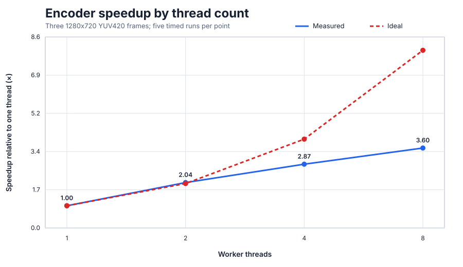
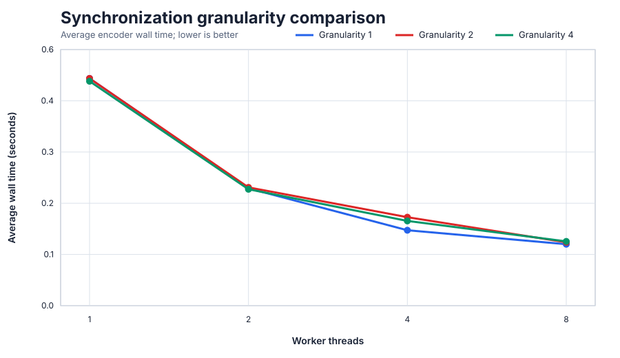
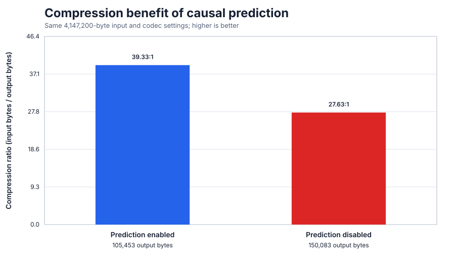

# Technical Report: Design and Evaluation of a Multithreaded Predictive Video Compressor in C

**Project:** OSPro multithreaded video compressor  
**Implementation language:** C11 with POSIX threads  
**Report date:** 9 October 2026  
**Primary implementation:** [`src/`](src/)  
**Experimental data:** [`benchmark/`](benchmark/)  

## Abstract

This project implements and evaluates a complete educational video-compression
pipeline in C. The encoder accepts raw planar YUV420 frames, divides each color
plane into 8×8 blocks, predicts every block from already reconstructed top and
left neighbors, transforms the prediction residual with a two-dimensional
discrete cosine transform (DCT), quantizes the coefficients, and entropy-codes
them using zig-zag run-length encoding (RLE) followed by Huffman coding. A
matching decoder reconstructs the same causal prediction state without relying
on private encoder data.

The concurrency design combines inter-frame parallelism with an intra-frame
wavefront. A bounded pthread worker pool processes row jobs, while per-plane
condition variables enforce top-neighbor dependencies. A separate reorder
writer commits completed compressed frames in numerical order. The design was
developed incrementally: the serial codec was validated first, then wavefront
bookkeeping, the job queue, one-worker execution, multiworker execution, full
Y/U/V processing, ordered output, performance tuning, and race detection.

On the retained three-frame 1280×720 YUV420 test input, the final encoder
reduced 4,147,200 raw bytes to 105,453 bytes, a measured compression ratio of
39.33:1. The decoded output measured 38.53 dB overall PSNR. The original
thread-count benchmark reduced average wall time from 0.540 seconds with one
worker to 0.150 seconds with eight workers, corresponding to 3.60× speedup.
Helgrind reported `0 errors from 0 contexts` for the final four-thread encoder
and decoder pipeline. These results apply to the stated input and environment;
they are not presented as general performance guarantees.

## 1. Problem definition and scope

The project had two connected goals:

1. Build a lossy block codec whose encoder and decoder remain synchronized
   despite prediction depending on previously reconstructed pixels.
2. Parallelize that codec without violating its causal dependencies or allowing
   out-of-order worker completion to corrupt the output stream.

The input format is planar 8-bit YUV420. A frame contains a full-resolution Y
plane and half-width, half-height U and V planes. The implemented bitstream is
a project-specific `FRM1` format containing a frame number, block count,
Huffman symbol/frequency table, bit count, and entropy-coded payload.

This is not a compliant JPEG or H.264 encoder. It deliberately combines
well-established ideas from those families in a smaller system suitable for
studying transform coding, causal prediction, pthread synchronization, and
parallel scheduling. It does not implement motion estimation, inter-frame
prediction, rate control, standard container metadata, or a standardized
bitstream syntax.

## 2. Selected design and basis in the literature

### 2.1 Predictive transform coding

The selected algorithm is **causal intra-predictive transform coding**. It is a
hybrid of two established principles:

- Predict the current spatial block from already reconstructed neighboring
  samples, then encode only the residual.
- Apply a frequency transform and quantization so less visually significant
  high-frequency information can be represented coarsely or eliminated.

The use of reconstructed neighboring samples is consistent with the central
idea of intra prediction in video standards. ITU-T H.264 specifies intra modes
using available neighboring reconstructed samples above and to the left of a
block; it also defines fallback behavior when neighbors are unavailable
([ITU-T H.264, Section 8.3](https://www.itu.int/rec/dologin_pub.asp?id=T-REC-H.264-202108-S%21%21PDF-E&lang=e&type=items)).
The present project uses a much simpler DC-like rule: average the eight pixels
on the top boundary and/or the eight pixels on the left boundary, with a flat
value of 128 for the first block. This is an intentional simplification, not an
implementation of an H.264 prediction mode.

The DCT was introduced by Ahmed, Natarajan, and Rao, who showed that it compares
closely with the statistically optimal Karhunen–Loève transform for relevant
signal models and rate-distortion behavior
([Ahmed, Natarajan, and Rao, 1974](https://doi.org/10.1109/T-C.1974.223784)).
Block DCT, quantization, coefficient reordering, and Huffman entropy coding are
also central elements of the JPEG family; the formal JPEG-1 reference is
[ITU-T T.81 / ISO/IEC 10918-1](https://www.itu.int/rec/T-REC-T.81).
The project adopts this general transform-coding structure but uses its own
prediction method, quantization behavior, and frame syntax.

Huffman coding was chosen because it gives a deterministic prefix code from
measured symbol frequencies and is straightforward to decode. The underlying
minimum-redundancy construction comes from Huffman's original method
([Huffman, 1952](https://doi.org/10.1109/JRPROC.1952.273898)). In this codec,
the symbols are `(zero_count, coefficient_value)` pairs produced by zig-zag
RLE, not individual bytes.

### 2.2 Why prediction is causal

For block coordinates `(r, c)`, prediction depends only on `(r-1, c)` and
`(r, c-1)`. Those dependencies form a directed acyclic graph because every
edge points toward an earlier row or earlier column. A valid traversal therefore
always exists.

Using right or bottom neighbors would create cyclic dependencies in a normal
raster traversal: a block would require data from blocks that themselves
eventually depend on it. Such a design would require iterative estimation,
non-causal signaling, or a fundamentally different partitioning method. It
could not be made correct merely by adding more threads. Restricting prediction
to top and left was therefore both a codec decision and the condition that made
wavefront parallelism possible.

### 2.3 Why prediction reads reconstructed pixels

The encoder must predict from `recon`, never from the original source pixels.
Quantization makes reconstruction lossy, so the decoder does not possess the
perfect original neighbor. If the encoder used `orig` while the decoder used
its reconstructed state, their predictors would diverge and every later
residual would be interpreted against a different reference.

For the same reason, reconstruction occurs immediately after quantization and
entropy preparation. A block is not marked complete until its reconstructed
pixels have been written. The progress update is therefore a synchronization
contract: any row awakened by it may safely read the published boundary.

### 2.4 Why a wavefront scheduler was chosen

Pure frame-level parallelism underuses cores when the input has few frames.
Pure block-level parallelism ignores prediction dependencies. The wavefront
model exposes the legal middle ground: blocks on a diagonal can execute in
parallel after their top and left predecessors finish.

Each plane maintains `row_progress[r]`, the number of columns safely published
for row `r`. Before processing `(r,c)`, a worker waits until
`row_progress[r-1] > c`; row zero never waits. The predicate is checked in a
`while` loop under a mutex, which is required because condition-variable
wakeups do not themselves assert that a particular predicate is true.

The implementation uses `pthread_cond_broadcast()` because multiple rows share
one condition variable and each has a different eligibility predicate. POSIX
specifies that broadcast unblocks all current waiters, whereas signal need only
unblock one ([The Open Group, POSIX `pthread_cond_broadcast`](https://pubs.opengroup.org/onlinepubs/9699919799/functions/pthread_cond_broadcast.html)).
Broadcast avoids waking only an ineligible row while an eligible row remains
asleep, at the cost of a possible thundering herd.

## 3. Final architecture

```mermaid
flowchart LR
    A[Raw YUV420 frames] --> B[Frame objects<br/>orig + recon]
    B --> C[One job per plane row]
    C --> D[Bounded circular queue]
    D --> E[pthread worker pool]

    subgraph WF[Per-frame, per-plane wavefront]
        E --> F[Wait for top progress]
        F --> G[Predict from recon]
        G --> H[Residual + separable DCT]
        H --> I[Quantize + zig-zag RLE]
        I --> J[Immediate reconstruction]
        J --> K[Publish progress]
        J -. boundary samples .-> G
    end

    I --> L[Frame-owned RLE block slots]
    L --> M[Frame-wide Huffman coding]
    M --> N[Reorder slot by frame number]
    N --> O[Ordered writer thread]
    O --> P[FRM1 bitstream]

    P --> Q[Huffman decode]
    Q --> R[RLE decode + dequantize + IDCT]
    R --> S[Predict from decoder recon]
    S --> T[Decoded YUV420]
```



### 3.1 Data ownership

`Frame` owns two separate contiguous YUV420 buffers:

- `orig`: immutable input used to calculate residuals.
- `recon`: progressively reconstructed pixels used by prediction.

`frame_plane()` is the only function that calculates Y, U, and V offsets. This
prevents repeated half-resolution chroma arithmetic from drifting across the
encoder, decoder, and tests. Jobs carry a direct `Frame *`, so workers do not
perform synchronized frame-ID lookups. The scheduler owns the responsibility
of keeping frames alive until all their jobs finish.

### 3.2 Thread pool and queue

The pool owns a bounded circular array with capacity `4 × thread_count`.
Producers wait on `not_full`; workers wait on `not_empty`. Head and tail indices
reuse preallocated slots. Compared with a linked queue, this avoids allocating
and freeing one node per row job, reducing allocator contention, fragmentation,
and pointer chasing.

Shutdown uses one sentinel job per worker. `threadpool_destroy()` enqueues the
sentinels, joins every thread, destroys queue synchronization objects, and then
releases storage.

### 3.3 Ordered completion

Rows and frames may complete in an unpredictable order. Each finished frame is
placed in a reorder slot indexed by frame number. A dedicated writer owns
`next_expected_frame` and writes only that slot. If frames 2 and 1 finish before
frame 0, both wait; after frame 0 is written, the counter advances and frames 1
and 2 can follow. This makes the disk bitstream deterministic without forcing
workers to finish frames sequentially.

## 4. Implementation details and pseudocode

### 4.1 Encoder

```text
read all complete YUV420 frames
allocate zeroed reconstruction and frame-local encoded-block storage
start reorder writer
start T worker threads

for plane in Y, U, V:
    for each block row in plane:
        for each frame:
            submit Job(frame, plane, row, wavefront_sync)

worker(Job j):
    for column c from 0 to block_columns - 1:
        wait until j.row == 0 or progress[j.row - 1] > c

        prediction = average(reconstructed top and/or left boundary)
        residual = original_block - prediction
        coefficients = separable_DCT(residual)
        quantized = round(coefficients / quantization_table)
        pairs = zigzag_RLE(quantized)
        store pairs in deterministic frame/block slot

        reconstructed_residual = IDCT(dequantize(quantized))
        recon_block = clip(prediction + reconstructed_residual, 0, 255)

        if end of synchronization group or final column:
            publish progress through c and broadcast

    decrement frame.remaining_rows
    if this was the final row:
        concatenate block RLE pairs in plane/raster order
        Huffman-encode the complete frame
        submit frame to reorder buffer

enqueue one shutdown sentinel per worker
join workers
writer emits frame slots in increasing frame-number order
```

### 4.2 Separable DCT

For an 8×8 residual block `x`, the implementation first transforms every row
and then every column using an orthonormal DCT-II basis:

```text
for each row r and frequency u:
    temp[r][u] = sum over x: input[r][x] * basis[u][x]

for each column v and frequency u:
    output[u][v] = sum over y: temp[y][v] * basis[u][y]
```

The inverse applies the transposed basis in the reverse direction. Tests show a
maximum DCT/IDCT numerical round-trip error of approximately
`1.28 × 10^-13` before quantization.

### 4.3 Entropy coding and frame format

The 64 quantized coefficients are visited in zig-zag order. A pair records the
number of preceding zeros and the next nonzero coefficient; an end pair
represents a zero tail. Frame-wide frequencies are counted over these pairs,
the Huffman tree is built with deterministic index-based tie breaking, and the
payload is packed most-significant bit first.

Each frame record contains:

1. Four-byte `FRM1` magic.
2. Frame number.
3. Block count.
4. Number of Huffman symbols.
5. Encoded bit count.
6. Symbol/frequency entries.
7. Packed Huffman payload.

### 4.4 Decoder

```text
for each FRM1 record in file order:
    read symbol table, frequencies, and packed bits
    rebuild the deterministic Huffman tree
    Huffman-decode the frame into RLE pairs
    clear decoder reconstruction buffer

    for Y, U, V planes in raster block order:
        quantized = inverse_zigzag_RLE(next pairs)
        residual = IDCT(dequantize(quantized))
        prediction = predict_from_neighbors(decoder.recon)
        reconstructed block = clip(prediction + residual, 0, 255)

    write contiguous Y, U, V reconstruction to raw output
```

The decoder intentionally does not read stored prediction values because none
are needed: the causal predictor is deterministic from decoder-visible state.

## 5. Development sequence, difficulties, and lessons

| Step | Work completed | Main difficulty | Learning and design consequence |
| ---: | --- | --- | --- |
| 1 | Defined project modules and `Frame`/`Job` types. | YUV420 contains planes with different dimensions, and multiple frames would be in flight. | Centralize offsets in `frame_plane()` and pass direct frame pointers with explicit lifetime ownership. |
| 2 | Implemented robust frame input. | EOF, truncated frames, allocation failure, and accidental exposure of future pixels had to be distinguished. | `orig` receives file bytes; `recon` starts at zero. Zeroing makes illegal early reads visible instead of masking them with correct-looking source data. |
| 3 | Implemented DCT and inverse DCT. | A direct 2D definition is clear but performs unnecessary repeated work. | Exploit separability: row and column transforms preserve the mathematics while reducing operation count. |
| 4 | Added causal DC prediction. | Encoder prediction could silently use pixels unavailable to the decoder. | Prediction must read only reconstructed top/left boundaries. This both prevents drift and creates an acyclic dependency graph. |
| 5 | Added immediate reconstruction. | Deferring reconstruction leaves later predictors without valid neighbors. | Reconstruction is part of the encoding critical path, not an optional post-pass. |
| 6 | Added quantization, zig-zag RLE, Huffman coding, and frame writing. | Entropy output must remain deterministic and independently decodable. | Store explicit symbol frequencies and deterministic tree tie-breaking; use zig-zag order to gather high-frequency zeros. |
| 7 | Built the decoder and PSNR test. | A decoder can appear correct if it accidentally shares encoder-only state. | Rebuild prediction solely from decoder `recon`; validate the real disk format, not just in-memory structures. |
| 8 | Added wavefront synchronization. | A row must sleep without missing wakeups or reading a partially reconstructed top block. | Guard progress with a mutex, wait in a predicate loop, reconstruct before publishing, and broadcast so every waiter can reevaluate its own dependency. |
| 9 | Proved `encode_row()` serially. | A scheduling abstraction can alter results even without concurrent execution. | Compare wavefront bookkeeping with a plain nested loop byte-for-byte before introducing thread timing. |
| 10 | Added the bounded thread-pool queue. | Unbounded row submission and per-job allocation would create memory and allocator pressure. | A circular array gives fixed memory, backpressure, and cache-friendly queue operations. |
| 11 | Ran real jobs with one worker. | Queue, job-copy, shutdown, or lifetime errors can resemble concurrency failures. | One-worker testing isolates pool integration while exercising every queue transition. |
| 12 | Enabled two and four workers. | Dependency bugs can be intermittent and schedule-specific. | Repeat deterministic comparisons many times and retain a serial reference. |
| 13 | Ran Helgrind. | Valgrind was unavailable natively on Apple Silicon. | Use an x86-64 Linux container with debug symbols and fail the run on any Helgrind error. No race or lock-order error was reported. |
| 14 | Completed Y/U/V, production-scale frames, disk output, and reorder writing. | Earlier tests covered only luma, toy frames, and transient results. | Treat chroma, realistic dimensions, and retained decode as mandatory correctness gates. All three passed. |
| 15 | Benchmarked 1, 2, 4, and 8 threads. | The first measurement was affected by cold-start behavior, and the test clip was short. | Add an untimed warm-up and five timed runs per point; report raw samples and avoid interpreting small differences as universal. |
| 16 | Tested synchronization granularities 1, 2, and 4. | Fewer locks can reduce overhead but delay visibility of completed blocks. | Granularity 1 won at four and eight workers: preserving wavefront width mattered more than reducing broadcasts. |
| 17 | Measured prediction ablation and generated the report figures. | No no-prediction result existed, so a graph could not honestly be produced from prior data. | Add a controlled compile-time experiment and measure it; never invent a missing comparison. |
| 18 | Added a live demo and performed the release audit. | A live demo needs normal video input, while the codec consumes raw YUV; the workspace also lacked Git metadata for a literal fresh clone. | Automate FFmpeg extraction/preview creation, and verify clean-build independence using an empty isolated source copy. Clang, GCC, tests, and final Helgrind checks passed. |

## 6. Correctness and quality validation

### 6.1 Unit and integration tests

The final test suite covers:

- Y, U, and V plane offsets and frame input.
- DCT/IDCT numerical round trip.
- Edge and interior predictions.
- Quantized reconstruction.
- Zig-zag RLE and Huffman coding.
- Randomized wavefront waits across 25 runs.
- `encode_row()` versus plain traversal.
- One-, two-, and four-worker output versus the serial baseline across 12 runs
  per worker count.
- End-to-end encode/decode and PSNR.

The production-scale gate used three colorful 1280×720 frames. One- and
four-worker encoders generated byte-identical bitstreams across ten repeated
runs. Both retained files decoded to identical 4,147,200-byte YUV output.

### 6.2 Image quality

Measured PSNR on that input was:

| Plane | PSNR |
| --- | ---: |
| Y | 39.27 dB |
| U | 38.50 dB |
| V | 36.42 dB |
| Overall | 38.53 dB |

Visual inspection found no U/V swap, chroma-plane shift, or luma-only output.
PSNR measures sample-domain error, not subjective visual quality; these three
frames are therefore a correctness and sanity result, not a comprehensive
perceptual study.

### 6.3 Build and race detection

The project builds without warnings under Apple Clang 17 and GCC 11 using
`-std=c11 -Wall -Wextra -Wpedantic -Werror`. The final isolated GCC build used
only the Makefile and source/test trees in an empty directory. A literal fresh
Git clone was not possible because the supplied workspace had no `.git`
metadata, but the isolated build established that no existing objects,
executables, generated fixtures, or workspace-specific paths were required.

Final Helgrind 3.18.1 results for the retained-file pipeline were:

| Program | Result |
| --- | --- |
| Four-thread `video_compressor` | `0 errors from 0 contexts` |
| `video_decoder` reading the produced file | `0 errors from 0 contexts` |

Race-detector success increases confidence for the exercised schedules; it is
not a mathematical proof that every possible execution is race-free.

## 7. Performance analysis

### 7.1 Theoretical computational cost

Let an `N×N` block have `N=8`.

- A direct 2D DCT evaluates an `N²`-sample sum for each of `N²` outputs:
  `O(N⁴)` work, or 4,096 core multiply-accumulate terms at `N=8`.
- The separable implementation performs `2N` one-dimensional transforms, each
  requiring `N²` work: `O(N³)`, or 1,024 terms at `N=8`.
- Quantization, inverse zig-zag, RLE, reconstruction, and prediction are each
  `O(N²)` per block.

For an image of width `W` and height `H`, YUV420 contains `1.5WH` samples. The
number of 8×8 blocks is:

```text
Y blocks + U blocks + V blocks
= WH/64 + 2(WH/4)/64
= 3WH/128
```

A 1280×720 frame therefore contains 21,600 blocks: 14,400 luma and 3,600 in
each chroma plane.

The current Huffman implementation favors clarity over asymptotic optimality.
It uses linear searches to discover and look up unique symbols and scans active
tree nodes when merging frequencies. If a frame contains `M` RLE pairs and `S`
unique pairs, these stages can approach `O(MS + S²)`. A hash table for symbol
counting and a priority queue for tree construction would reduce this cost for
larger alphabets.

### 7.2 Theoretical wavefront parallelism

For a plane with `R` block rows and `C` block columns, serial execution has
`RC` block steps. With unit-cost blocks, unlimited processors, and no overhead,
the causal critical path spans `R + C - 1` diagonal steps. The maximum average
parallelism is therefore approximately:

```text
P_average = RC / (R + C - 1)
```

For the 1280×720 luma plane, `R=90` and `C=160`, giving an idealized average of
about 57.8 simultaneously useful block operations. Each chroma plane has
`R=45`, `C=80`, giving about 29.0. These are dependency-graph ceilings, not
predictions of measured speedup. The implementation schedules rows rather than
individual blocks, runs finite worker counts, processes multiple frames,
performs synchronization and allocation, and includes serial frame
finalization and I/O.

Wavefront utilization also changes over time. At frame start, few rows are
runnable; the diagonal widens through the middle; then it narrows near the end.
This ramp-up/ramp-down effect explains why adding threads eventually yields
diminishing returns even though many total blocks exist.

### 7.3 Empirical thread scaling

The original thread benchmark used the same three-frame 1280×720 input, one
untimed warm-up per thread count, and five timed runs. It measured the complete
encoder process, including input, transform coding, synchronization,
frame-wide Huffman coding, reorder writing, and disk output.

| Threads | Average time | Speedup | Parallel efficiency |
| ---: | ---: | ---: | ---: |
| 1 | 0.540 s | 1.000× | 100.0% |
| 2 | 0.264 s | 2.045× | 102.3% |
| 4 | 0.188 s | 2.872× | 71.8% |
| 8 | 0.150 s | 3.600× | 45.0% |

The two-thread result is slightly superlinear. It should be interpreted as
cache/timing variation on a short workload, not as evidence that two processors
perform more than twice the useful work. Four and eight threads provide real
speedup, but efficiency falls because of the causal critical path, serial
finalization and I/O, mutex/condition-variable overhead, and limited work during
wavefront ramp-up and ramp-down.



### 7.4 Synchronization-granularity experiment

`SYNC_GRANULARITY` controls how many reconstructed blocks are grouped before a
row publishes progress. Granularities 2 and 4 reduce lock acquisitions and
broadcasts, but keep usable blocks invisible to the next row for longer.

| Granularity | 1 thread | 2 threads | 4 threads | 8 threads |
| ---: | ---: | ---: | ---: | ---: |
| 1 | 0.488 s | 0.252 s | **0.162 s** | **0.132 s** |
| 2 | 0.488 s | 0.254 s | 0.190 s | 0.136 s |
| 4 | **0.482 s** | **0.250 s** | 0.182 s | 0.138 s |

At four workers, granularity 1 was 14.7% faster than granularity 2 and 11.0%
faster than granularity 4. At eight workers it was 2.9% and 4.3% faster,
respectively. Differences at one and two workers are at or near the timer's
0.01-second resolution. The evidence supports granularity 1 for this workload:
the extra synchronization is cheaper than the parallelism lost by delayed
publication.



### 7.5 Compression and prediction ablation

The retained input size was 4,147,200 bytes.

| Configuration | Output bytes | Compression ratio | Output as percentage of input |
| --- | ---: | ---: | ---: |
| Causal prediction enabled | 105,453 | 39.33:1 | 2.54% |
| Fixed 128 prediction | 150,083 | 27.63:1 | 3.62% |

Prediction saved 44,630 bytes, reducing compressed size by 29.74% relative to
the no-prediction output. This supports the intended mechanism: neighboring
reconstructed blocks provide a closer baseline than constant mid-gray, so the
residual contains more small and zero-valued transform coefficients. The result
is specific to the three-frame test input; a larger content corpus is required
before generalizing the percentage.



## 8. Limitations and threats to validity

1. **Small performance corpus.** The principal benchmark contains only three
   frames. It is sufficient to exercise production dimensions and concurrency,
   but too short for stable microsecond-level comparisons.
2. **Timer resolution.** `/usr/bin/time -p` reports hundredths of a second on
   the test platform. Differences of one or two hundredths may be noise.
3. **Single machine.** Thread scaling and mutex cost depend on processor count,
   cache hierarchy, operating system, and pthread implementation.
4. **Intra-only coding.** Frames are compressed independently. Modern video
   codecs obtain much of their compression from temporal prediction, which is
   intentionally outside this project's scope.
5. **Whole-file residency.** The encoder reads all frames before scheduling
   work. Memory consumption therefore grows with video length. A bounded frame
   window would be more appropriate for long videos.
6. **Educational entropy implementation.** Linear symbol searches and
   quadratic Huffman-tree selection are clear and deterministic but not ideal
   for large workloads.
7. **Fixed quantization.** There is no quality factor, bitrate target, or rate
   control. Reported PSNR and compression ratio apply to one fixed table.
8. **PSNR is incomplete.** PSNR does not fully model human perception; no formal
   subjective quality study was performed.
9. **Race testing is finite.** Repeated comparisons and Helgrind found no
   defects, but dynamic analysis observes only executed paths and schedules.

## 9. Principal lessons

- Correct parallelization begins with the dependency graph. A cyclic prediction
  rule cannot be rescued by synchronization; the algorithm itself must expose
  an acyclic order.
- Lossy encoders must predict from reconstructed state. Encoder-only source
  information is not a valid reference, even when it produces attractive local
  results.
- A completion flag is a promise about data visibility. Reconstruction must be
  complete before progress is published.
- Determinism requires explicit ordering at system boundaries. The reorder
  buffer lets computation finish out of order while keeping the file ordered.
- Concurrency should be introduced in isolatable stages: serial reference,
  bookkeeping-only traversal, one worker, multiple workers, then race tools.
- Lower synchronization frequency is not automatically faster. It can narrow
  the runnable wavefront enough to cost more than the locks it removes.
- Benchmarks need warm-ups, repeated raw measurements, retained inputs, and
  stated limitations. Missing experiments should be measured, not inferred.
- Documentation must evolve with the code. The final audit corrected historical
  statements that had become ambiguous after frame-wide Huffman coding and
  configurable synchronization were introduced.

## 10. Conclusion

The project achieved its intended technical objective: a working end-to-end
lossy YUV420 codec whose causal state remains consistent between encoder and
decoder and whose legal parallelism is exploited by pthread workers. The final
architecture is justified by the dependency structure rather than by thread
count alone: top/left prediction produces a DAG, immediate reconstruction makes
dependencies concrete, wavefront scheduling exposes ready work, and the reorder
buffer separates completion order from output order.

The measured results support, but do not overstate, the design. The codec
produced 39.33:1 compression and 38.53 dB overall PSNR on the retained
three-frame input. Eight workers achieved 3.60× measured speedup rather than an
idealized 8×, which is consistent with dependency stalls and serial work.
Per-block progress publication was faster than coarser synchronization at the
important four- and eight-worker settings. Causal prediction reduced compressed
size by 29.74% relative to the controlled fixed-prediction variant. Finally,
warning-clean Clang/GCC builds, deterministic comparisons, retained-file
round trips, and clean Helgrind runs provide concrete evidence that the tested
implementation is stable.

## References

1. N. Ahmed, T. Natarajan, and K. R. Rao, “Discrete Cosine Transform,” *IEEE
   Transactions on Computers*, vol. C-23, no. 1, pp. 90–93, 1974.
   [doi:10.1109/T-C.1974.223784](https://doi.org/10.1109/T-C.1974.223784)
2. D. A. Huffman, “A Method for the Construction of Minimum-Redundancy Codes,”
   *Proceedings of the IRE*, vol. 40, no. 9, pp. 1098–1101, 1952.
   [doi:10.1109/JRPROC.1952.273898](https://doi.org/10.1109/JRPROC.1952.273898)
3. ITU-T Recommendation T.81, *Information technology—Digital compression and
   coding of continuous-tone still images—Requirements and guidelines*, 1992.
   [Official recommendation page](https://www.itu.int/rec/T-REC-T.81)
4. ITU-T Recommendation H.264, *Advanced video coding for generic audiovisual
   services*, August 2021.
   [Official recommendation](https://www.itu.int/rec/dologin_pub.asp?id=T-REC-H.264-202108-S%21%21PDF-E&lang=e&type=items)
5. The Open Group, *POSIX.1-2017: pthread_cond_broadcast and
   pthread_cond_signal*.
   [Specification](https://pubs.opengroup.org/onlinepubs/9699919799/functions/pthread_cond_broadcast.html)

## Appendix A: Reproducing the measured project results

Build and run the complete test suite:

```sh
make clean
make
make test
```

Run the encoder benchmark:

```sh
benchmark/benchmark_encoder.sh input.yuv WIDTH HEIGHT 5 benchmark/results.csv
```

Regenerate the retained SVG figures:

```sh
python3 benchmark/plot_results.py
```

Run the automated live demo from an ordinary video file:

```sh
./demo.sh input.mp4 5 demo_output
```

The demo extracts YUV420 with FFmpeg, encodes with four workers, prints wall
time and compression ratio, decodes the custom bitstream, creates an H.264 MP4
preview, and opens the system viewer.
